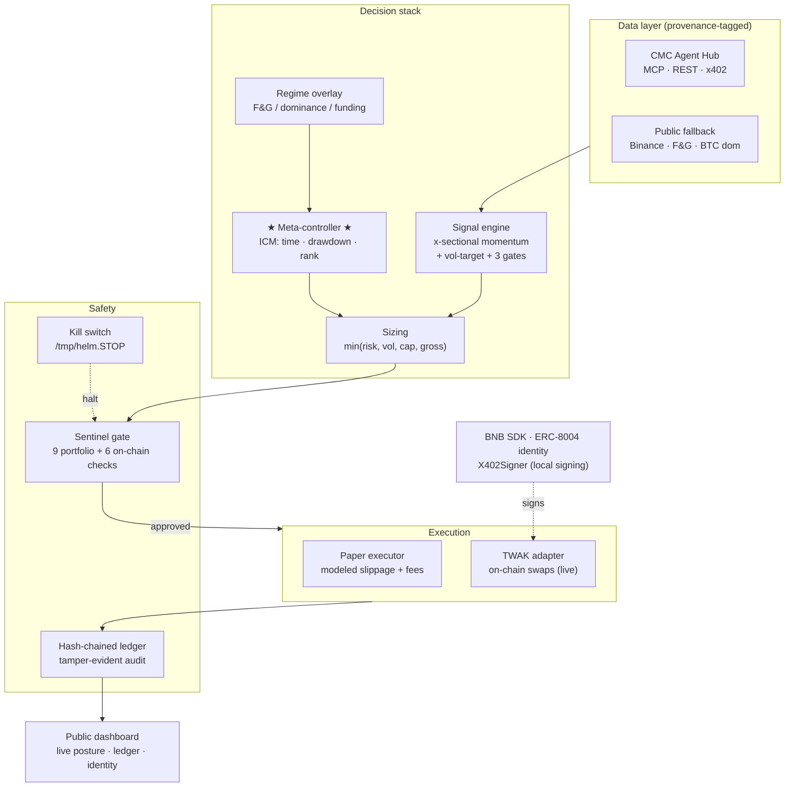

<div align="center">

# H·E·L·M

### Autonomous on-chain trading agent that plays the *tournament*, not the chart.

**H**ands-off · **E**xecution · **L**ocal-signing · **M**eta-controller

*Your keys, your helm.*

`BNB Hack: AI Trading Agent Edition` — CoinMarketCap × Trust Wallet
Track 1 · Autonomous Trading Agents

</div>

---

## TL;DR

HELM is a self-custodial trading agent for the BNB Chain contest. Most agents
optimize the **chart** — maximize expected return on the next candle. A trading
*contest* is a different game: you win by **where you finish in the field over a
fixed week**, with a hard drawdown gate that turns a blow-up into a zero.

HELM's edge is a **Contest-Optimal Meta-Controller** that borrows from poker
tournament theory (ICM): it sizes risk by *time left*, *drawdown budget left*,
and *rank posture* — not just signal strength. On top sits a vol-targeted,
cross-sectional momentum engine, a deterministic risk gate, and a tamper-evident
audit log. It runs **end-to-end in paper mode with zero credentials**, and arms
for live on-chain execution behind two explicit safety flags.

```bash
pip install -r requirements.txt
python -m helm.cli signal     # one-shot: regime + ranked shortlist + contest posture
python -m helm.cli run        # one decision cycle (paper, no keys needed)
python -m helm.cli dashboard  # public dashboard at http://127.0.0.1:8600
```

---

## Why a tournament needs different play (the thesis)

In a normal portfolio, chips (equity) are roughly linear in utility. In a
**tournament**, they are not — the same insight as the Independent Chip Model in
poker. Track 1 is scored on **pure total return**, with disqualification only at a
30% drawdown. So the winning play is neither reckless max-risk *nor* the
survival-first crouch most of the field defaults to — it's **calibrated
aggression with the DQ gate as the binding constraint**:

- **The gate is the only hard line.** Breaching the 30% drawdown gate is a zero,
  no matter how good your signal was. So as drawdown approaches it, HELM cuts risk
  **convexly** (`budget_left**1.3`) — fast and early. *Below* that, it deploys
  hard: a return race rewards being invested, not sitting in stablecoins.
- **Time changes the optimal variance.** Early in the week, variance is cheap —
  build the stack. Late, with a lead, variance is the enemy — lock it in.
- **Rank dictates aggression.** Behind near the end? Take *bounded* extra
  variance to reach the money — but never enough to risk the gate. Ahead? Shed
  variance and defend.

Most of the field optimizes the wrong objective — they tune for low drawdown and
quietly concede the return race. A pure return-maximizer ignores the gate and
risks a zero. HELM does both: a contest-tuned `aggressive` posture that deploys
for the highest return, folded with the gate, the clock, and rank into **one
auditable risk budget every cycle**. **That is the edge.**


---

## What HELM integrates (Track 1 + all three special prizes)

| Sponsor stack | How HELM uses it | Prize target |
|---|---|---|
| **Trust Wallet Agent Kit (TWAK)** | Self-custodial wallet, on-chain swaps on BNB Chain, `compete register/status`, x402 data requests, and a 6-point on-chain **security checklist** (honeypot, contract-verified, slippage/approval bounds, preflight sim, MEV) before any swap. | **Best Use of TWAK** |
| **CoinMarketCap Agent Hub** | Market data via **MCP** (JSON-RPC) + REST, with Fear & Greed and global metrics feeding the regime overlay; **x402** pay-per-call wired with a hard wei ceiling. Degrades gracefully to public data with no key. | **Best Use of Agent Hub** |
| **BNB AI Agent SDK** | **ERC-8004** on-chain agent identity (`register_agent` → `agentId`), local **keystore-V3** wallet via `EVMWalletProvider`, and an **X402Signer** with a strict signing policy + per-call/session spend caps keyed to known payment tokens. | **Best Use of BNB AI Agent SDK** |
| **Autonomous loop** | Fully hands-off decision cycle: data → signals → contest posture → risk gate → execution → audit. ≥1 trade/day floor to stay eligible; survives restarts via persisted state. | **Track 1 · 1st place** |

Every datum is **provenance-tagged** (which source it came from), and every
decision is written to a **hash-chained ledger** anyone can re-verify offline.

---

## Architecture



### The decision cycle (one `step`)

1. Refresh market data → cross-sectional **signals** + **regime** scalar.
2. Mark the book; roll the UTC day (resets daily-loss + trade counters).
3. Ask the **meta-controller** for today's risk budget (folds in regime).
4. Manage open risk **first**: stops / take-profits / trailing exits.
5. If new risk is allowed: size the top-ranked names, pass each through
   **Sentinel**, execute only what's approved.
6. Guarantee the **≥1-trade/day** contest floor.
7. Append every signal, verdict, and fill to the **tamper-evident ledger**.

---

## Safety & trust

- **Deterministic gate, not an LLM.** The `Sentinel` makes the go/no-go call with
  explicit, human-readable checks — kill-switch, contest halt, daily-loss limit,
  position slots, gross cap, per-position cap, liquidity, slippage, dust. No model
  output ever reaches the swap path.
- **Calibrated to the gate.** Two profiles: `balanced` (safe default, halt at 22%)
  and `aggressive` (the live contest posture, halt at 26% — still a 4-pt margin to
  the 30% gate). Both cut risk **convexly** before the halt; neither can breach the
  gate without the taper firing first. The dial moves; the guardrails don't.
- **Two-flag live arming.** Real swaps require `HELM_MODE=live` **and**
  `HELM_EXECUTE_TRADES=1` **and** `HELM_EXECUTE_CHAIN=1`. Anything less is
  quote-only.
- **Self-custody + local signing.** Keys never leave the machine; the BNB SDK
  `X402Signer` enforces per-call and per-session spend caps with a strict policy
  (denies `Permit`/`Permit2`, allows EIP-3009 transfers only).
- **Tamper-evident audit.** `helm verify` replays the SHA-256 hash chain and
  detects a single edited byte.
- **Kill switch.** `touch /tmp/helm.STOP` blocks all new risk instantly.
- **OWASP-aware.** No secrets in logs (`Secrets.redacted()`), inputs validated at
  boundaries, all network calls timeout + retry with provenance.

---

## Quickstart (paper mode — zero credentials)

```bash
python3 -m venv .venv && source .venv/bin/activate
pip install -r requirements.txt

# 1) See the brain think: regime, ranked shortlist, contest posture
python -m helm.cli signal

# 2) Run decision cycles (paper fills, persisted state, audit ledger)
python -m helm.cli run --cycles 3

# 3) Prove the audit log is intact
python -m helm.cli verify

# 4) Watch it live
python -m helm.cli dashboard        # http://127.0.0.1:8600
```

No API keys, no wallet, no funds required — HELM is fully functional in paper
mode and only *adds* capabilities when credentials are present.

### CLI reference

| Command | What it does |
|---|---|
| `helm signal` | One-shot regime + ranked shortlist + contest posture. |
| `helm run [--dry-run] [--cycles N] [--interval S]` | Run the agent loop. |
| `helm preflight` | Contest-readiness checklist (paper- or live-aware). |
| `helm status` | Portfolio + ledger snapshot. |
| `helm verify` | Re-verify the hash-chained audit ledger. |
| `helm backtest [--days N] [--stride H]` | Walk-forward backtest over historical data. |
| `helm dashboard` | Launch the public dashboard. |
| `helm register` | *(live)* Register for the competition via TWAK. |
| `helm identity [--force]` | *(live)* Mint/show the ERC-8004 on-chain identity. |

---

## Backtest — honest, walk-forward, no lookahead

`helm backtest` replays the **exact live components** (same SignalEngine,
MetaController, Sentinel, sizing, and PaperExecutor slippage/fees) over historical
1h candles, revealing data only up to each bar — no peeking at the future.

### Two postures, one engine

HELM ships **switchable risk profiles** (`profile:` in config, or `HELM_PROFILE`):

- **`balanced`** — capital-preservation posture. The safe default for paper, CI
  and demos. This is the posture most of the field runs.
- **`aggressive`** — the **contest** posture. Track 1 is scored on *pure total
  return* with disqualification only at a 30% drawdown. So the binding constraint
  isn't an over-cautious internal line — it's the **30% gate**. Aggressive stays
  deployed through fear (≈60% gross vs 29%), concentrates in the top momentum
  names, and lets winners run, while **every** guardrail (kill-switch, Sentinel
  pre-trade checks, hash-chained ledger, convex drawdown taper, DQ halt) stays
  fully enforced. The live week runs `aggressive`; the meta-controller still
  auto-escalates (catch-up) or de-risks (protect-lead / drawdown taper) within it.
- **`max`** — an endgame catch-up dial (hottest, ~2-pt DQ margin) the
  meta-controller can lean on only if we're trailing late.

### A/B across three regimes (33-day windows, 6h rebalance, top-3)

The point is not one lucky window — it's the *shape* across regimes, and what the
contest posture buys over the conservative default:

| Window | `balanced` | **`aggressive`** | Agg. excess vs BTC | Bal. Max DD | **Agg. Max DD** | Survived 30% gate |
|---|---|---|---|---|---|---|
| **Bull** — Q4 2024 (`--end 2024-12-15`) | +26.0% | **+29.6%** | **+9.7%** | 7.6% | 12.4% | ✓ |
| **Bear** — recent (`latest`) | −9.6% | **−9.3%** | **+7.4%** | 10.9% | 13.9% | ✓ |
| **Chop** — Aug–Sep 2024 (`--end 2024-09-10`) | −3.1% | **+4.1%** | **+1.5%** | 10.8% | 12.1% | ✓ |

Read it honestly:

- **Aggressive dominates or matches balanced in every regime** — on both total
  return *and* excess-vs-BTC — for only a modest rise in drawdown (worst case
  13.9%, with **16 points of headroom to the 30% gate**).
- **It turns the chop loss into a BTC-beating gain** (−3.1% → +4.1%): wider
  take-profits and staying deployed beat getting nickel-and-dimed by fees.
- **Survival held in every regime.** The convex drawdown taper + regime throttle
  kept max drawdown ≤ 14% even at 0.85 vol-target and 33% per-name concentration.

### The contest is **7 days** — here's the real 1-week distribution

A 33-day window understates single-week variance, so we sampled seven distinct
one-week slices (the actual contest length) with the `aggressive` profile:

| Week ending | Return | Max DD | Survived |
|---|---|---|---|
| 2024-03-15 | −0.3% | 6.0% | ✓ |
| 2024-06-20 | −7.0% | 10.3% | ✓ |
| 2024-08-05 | −5.2% | 9.0% | ✓ |
| 2024-09-10 | +1.8% | 6.0% | ✓ |
| 2024-11-12 | **+16.6%** | 4.6% | ✓ |
| 2024-12-15 | +2.0% | 11.6% | ✓ |
| 2025-01-20 | +0.8% | 8.2% | ✓ |

A typical week clusters near 0–2%, the **worst week was −7.0% (only 10% DD)**, and
there's a **fat right tail (+16.6%)** when momentum trends — exactly the outcome
that wins a return race. **Every sampled week survived far under the 30% gate.**

> Honest about variance: a one-week, return-ranked sprint is variance-dominated —
> no agent can *guarantee* 1st. HELM's edge is structural: capture the right-tail
> upside that wins, while the drawdown taper makes a disqualifying blow-up
> extremely unlikely. That maximizes expected value across *all four* prizes.

Costs (modeled square-root slippage + round-trip fees) are charged on every fill.
Regime is held *neutral* in backtest (no historical Fear & Greed feed), so the
live de-risking overlay would, if anything, make the bear/chop windows **more**
conservative. Reproduce any window:

```bash
HELM_PROFILE=aggressive python -m helm.cli backtest --end 2024-12-15   # bull
HELM_PROFILE=aggressive python -m helm.cli backtest                     # latest
HELM_PROFILE=aggressive python -m helm.cli backtest --days 7 --end 2024-11-12  # 1-week
```

Results are written to [backtest/results.json](backtest/results.json).

> Methodology note: public OHLCV, no survivorship-free dataset. The curated
> universe is liquid majors that existed across each window. This is a
> methodology demonstrator — the official contest result is produced live.


---

## Going live (optional, behind safety flags)

```bash
cp .env.example .env        # fill in TWAK + CMC + BNB keys
bash scripts/setup_live.sh  # installs TWAK CLI + bnbagent, creates wallet
```

Then set in `.env`:

```ini
HELM_MODE=live
HELM_EXECUTE_TRADES=1
HELM_EXECUTE_CHAIN=1
HELM_PROFILE=aggressive       # the contest posture (tuned for total return)
```

```bash
python -m helm.cli identity     # mint ERC-8004 identity (BNB AI Agent SDK)
python -m helm.cli register      # register for the competition (TWAK)
python -m helm.cli preflight     # confirm READY — every arming check must be green
python -m helm.cli run --cycles 1000 --interval 900   # autonomous, 15-min cadence
```

Live swaps still pass through Sentinel + the on-chain security checklist, and
remain quote-only unless **all** arming flags are set.

---

## Tests

```bash
pip install -r requirements-dev.txt
pytest
```

The suite pins the safety-critical logic: ledger tamper-evidence, the
meta-controller's survival/posture transitions, position-sizing budgets, and
every Sentinel veto.

---

## Project layout

```
helm/
  config.py            typed config (.env + YAML, boundary coercion)
  universe.py          eligible BEP-20 set + curated tradeable list
  data/                CMC (MCP/REST/x402) + public fallback, provenance-tagged
  signals/             volatility · momentum · regime · engine (3 honest gates)
  contest/             ★ meta_controller.py — the ICM edge
  risk/                sizing (min of 4 budgets) · sentinel (deterministic gate)
  execution/           base · paper (modeled fills) · twak (live on-chain)
  identity/            erc8004.py — BNB AI Agent SDK identity + X402Signer
  portfolio.py         accounting · marks · stops/TP/trailing exits
  ledger.py            hash-chained, tamper-evident audit log
  agent.py             the orchestration loop
  dashboard/           FastAPI public dashboard + template
  cli.py               signal · run · verify · status · backtest · dashboard · …
backtest/
  walk_forward.py      replays the live stack over history (no lookahead)
tests/                 ledger · meta-controller · sizing · sentinel
scripts/               verify_offline.sh · setup_live.sh
config/settings.yaml   full strategy configuration
```

---

## Non-goals (by design)

- **No token launch, no fundraising, no financial advice.** HELM trades a small
  self-custodied book in a contest. It does not solicit funds or shill assets.
- **No discretionary LLM trading.** The language layer never signs or sizes; the
  deterministic gate does. This is a safety choice.

---

<div align="center">

**HELM plays the tournament, not the chart.**

*Hands-off · Execution · Local-signing · Meta-controller*

</div>
